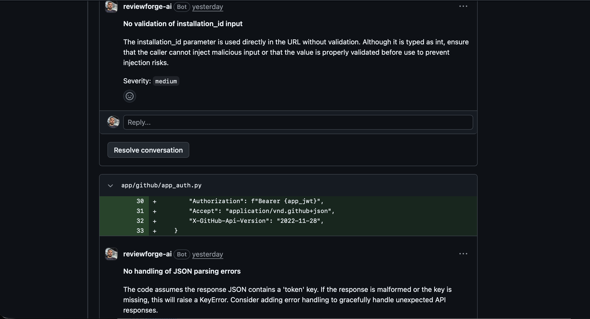
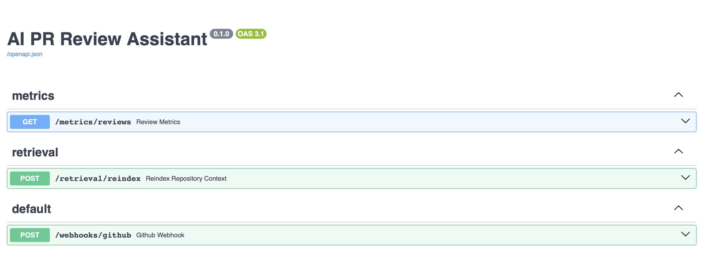
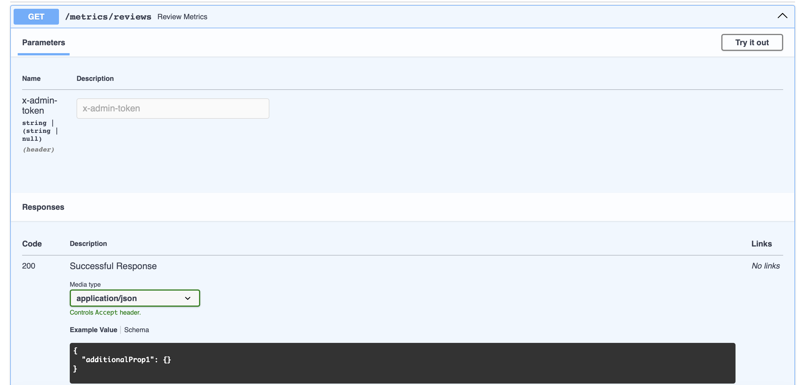
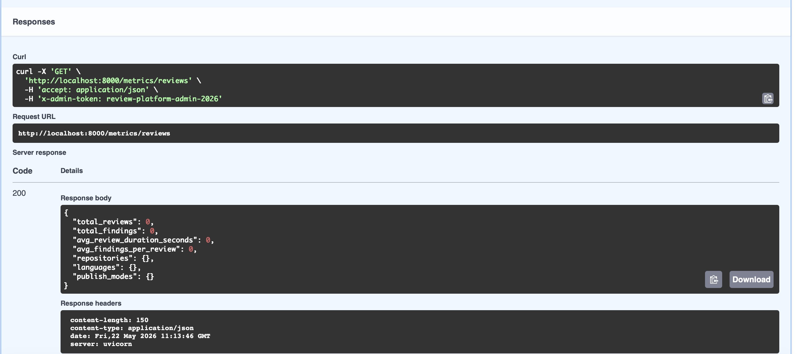

# AI PR Review Assistant

AI PR Review Assistant is a repository-aware AI review platform that integrates with GitHub to automate pull request analysis using asynchronous multi-agent LLM orchestration, semantic repository retrieval, and structured inline engineering feedback.

The platform is designed as production-oriented backend infrastructure: GitHub webhooks are verified, workloads are processed asynchronously through Celery and Redis, semantic retrieval augments repository awareness, and operational metrics expose review pipeline behavior.

---

# 🧩 Problem

Modern engineering teams struggle with:

* slow pull request review cycles
* inconsistent review quality
* reviewer overload
* large pull requests with missing context
* architectural drift across repositories
* difficulty enforcing consistent engineering standards

Traditional code review workflows rely heavily on manual effort and reviewer availability, making it easy for security risks, performance regressions, missing tests, and architectural concerns to go unnoticed.

---

# 🚀 Solution

AI PR Review Assistant provides a repository-aware AI review pipeline that:

1. reacts to GitHub pull request events
2. validates and queues review workloads asynchronously
3. retrieves repository and semantic context
4. runs specialized AI reviewers
5. validates findings against actual PR diff lines
6. publishes inline GitHub review comments
7. tracks operational metrics and telemetry

The system is intentionally designed as engineering platform infrastructure rather than a simple AI wrapper.

---

# ✨ Features

## GitHub Integration

* GitHub App authentication
* Signed webhook verification
* Pull request webhook ingestion
* Inline GitHub review comments
* Summary comment fallback behavior
* Repository-scoped permissions

---

## AI Review Pipeline

* Multi-agent AI reviewer orchestration
* Language-aware review prompts
* Structured JSON AI outputs
* Confidence scoring and filtering
* Diff chunking for large pull requests
* Repository-aware prompting
* Semantic repository retrieval
* Valid changed-line filtering

---

## Reliability & Scalability

* Async background workers with Celery
* Redis-backed distributed queueing
* Idempotent review execution
* PR size guardrails
* Retry handling
* Graceful malformed AI response fallback
* Chunked review execution
* Bounded workload processing

---

## Observability

* Structured logging
* OpenTelemetry instrumentation foundation
* Redis-backed metrics APIs
* Review duration tracking
* Findings analytics
* Publish-mode metrics

---

## Deployment

* Dockerized services
* Docker Compose orchestration
* GitHub Actions CI pipeline
* Railway / Render / Fly.io compatible

---

# ⚙️ Tech Stack

| Area               | Technology                    |
| ------------------ | ----------------------------- |
| API                | FastAPI                       |
| Async Workers      | Celery                        |
| Queue/Broker       | Redis                         |
| AI                 | OpenAI API                    |
| Semantic Retrieval | FAISS + Sentence Transformers |
| CI/CD              | GitHub Actions                |
| Containerization   | Docker Compose                |
| Telemetry          | OpenTelemetry                 |
| GitHub Integration | GitHub Apps                   |
| Quality            | Ruff + Pytest                 |

---

# 🗂️ Repository Structure

```txt
ai-pr-review-assistant/
├── app/
│   ├── ai/
│   ├── core/
│   ├── github/
│   ├── metrics/
│   ├── retrieval/
│   ├── review/
│   ├── tasks.py
│   ├── worker.py
│   └── main.py
│
├── docs/
│   ├── architecture.md
│   ├── diagrams/
│   └── screenshots/
│
├── tests/
├── scripts/
├── docker-compose.yml
├── requirements.txt
├── README.md
└── .env.example
```

---

# 🏗️ Engineering Impact

This project demonstrates:

* Platform engineering with GitHub App integration
* Distributed asynchronous processing with Celery and Redis
* Multi-agent LLM orchestration
* Repository-aware semantic retrieval
* Secure webhook validation
* Idempotent distributed job execution
* Production-oriented observability patterns
* AI workflow reliability engineering
* Scalable backend architecture design

---

# 🧭 Architecture

```txt
GitHub Pull Request Event
        |
Webhook API (FastAPI)
        |
Webhook Signature Verification
        |
Celery Queue
        |
Redis Broker
        |
Background Worker
        |
Review Pipeline
   |-- Diff Chunking
   |-- Language Detection
   |-- Multi-Agent Reviewers
   |-- Semantic Context Retrieval
   |-- Confidence Filtering
   `-- Diff-Line Validation
        |
GitHub Review Publisher
        |
Metrics + Telemetry
```

See:

* [docs/architecture.md](docs/architecture.md)
* [docs/diagrams/](docs/diagrams/)

for additional architecture details and Mermaid diagrams.

---

# 🧠 Multi-Agent Review Architecture

Instead of using a single generic AI reviewer, the platform orchestrates multiple specialized reviewer agents.

Current reviewer types:

* Security Reviewer
* Performance Reviewer
* Maintainability Reviewer
* Test Coverage Reviewer
* Architecture Reviewer

Each reviewer:

* receives repository-aware context
* applies language-specific prompting
* produces structured findings
* contributes to aggregated review output

This architecture improves:

* specialization
* extensibility
* review quality
* future fine-tuning opportunities

---

# 🔎 Semantic Repository Retrieval

The platform supports repository-aware reviews through semantic embedding search.

## Retrieval Flow

```txt
Changed File
    ↓
Semantic Embedding Search
    ↓
Relevant Repository Files
    ↓
Repository Context Injection
    ↓
AI Review Generation
```

## Indexed Sources

Examples:

* README.md
* CONTRIBUTING.md
* architecture docs
* adjacent Python modules
* configuration files
* related source files

## Technologies

* Sentence Transformers
* FAISS
* cosine similarity search

---

# 🔐 Security Considerations

The platform includes:

* GitHub webhook signature verification
* Scoped GitHub App permissions
* Admin-protected maintenance endpoints
* Redis-backed idempotent processing
* Secret isolation through environment variables
* Safe fallback handling for malformed AI responses
* Review workload guardrails

---

# 📈 Scalability Considerations

The platform was designed with scalability in mind:

* asynchronous review execution through Celery workers
* bounded workload processing via diff chunking
* semantic retrieval decoupled from review execution
* Redis-backed distributed coordination
* repository-scoped GitHub App authentication
* modular reviewer orchestration
* retryable distributed background jobs

---

# ⚖️ Key Engineering Decisions

## Why Celery + Redis?

Webhook handlers should return quickly to avoid GitHub timeouts and isolate long-running AI workloads.

Celery + Redis provides:

* asynchronous execution
* retry handling
* workload isolation
* distributed worker scalability

---

## Why Multi-Agent Reviewers?

Specialized reviewer profiles improve:

* focus
* extensibility
* maintainability
* review quality

compared to a single generic reviewer.

---

## Why Semantic Retrieval?

Diff-only reviewing lacks:

* repository awareness
* architectural context
* coding convention understanding

Semantic retrieval injects relevant repository knowledge into prompts.

---

## Why Chunking?

Large pull requests create:

* token pressure
* latency spikes
* hallucination risk

Chunking provides bounded prompt sizes and safer review execution.

---

## Why Idempotency?

GitHub webhooks may retry deliveries.

Redis-backed idempotency prevents duplicate reviews and duplicate GitHub comments.

---

## Why GitHub App Authentication?

GitHub Apps provide:

* scoped permissions
* repository isolation
* organization install support
* production-grade integration patterns

---

# 💻 Local Development

## Requirements

* Python 3.12+
* Docker
* Redis
* GitHub App
* OpenAI API key

---

# Installation

## Clone Repository

```bash
git clone <repo-url>
cd ai-pr-review-assistant
```

---

## Create Virtual Environment

```bash
python3 -m venv .venv
source .venv/bin/activate
```

---

## Install Dependencies

```bash
pip install -r requirements.txt
```

---

# 🔧 Environment Variables

Create `.env`

```txt
OPENAI_API_KEY=
GITHUB_TOKEN=
GITHUB_APP_ID=
GITHUB_PRIVATE_KEY_PATH=./github-app-private-key.pem
GITHUB_WEBHOOK_SECRET=
REDIS_URL=redis://redis:6379/0
ADMIN_API_TOKEN=
```

---

# 🐳 Docker Deployment

## Build Containers

```bash
docker compose build
```

---

## Run Services

```bash
docker compose up --build
```

Services:

* API → [http://localhost:8000](http://localhost:8000)
* Swagger → [http://localhost:8000/docs](http://localhost:8000/docs)
* Redis → localhost:6379

---

# 🔁 Running Celery Worker

```bash
celery -A app.worker.celery_app worker --loglevel=info
```

---

# 🔗 GitHub App Setup

## Repository Permissions

* Pull Requests → Read & Write
* Contents → Read-only
* Metadata → Read-only
* Issues → Read & Write

---

## Webhook Events

* Pull Request

---

# Webhook Configuration

Example webhook URL:

```txt
https://your-domain.com/webhooks/github
```

Webhook secret must match:

```txt
GITHUB_WEBHOOK_SECRET
```

---

# 🧪 GitHub Actions CI

The project includes:

* linting
* tests
* dependency installation
* Redis service setup

Pipeline location:

```txt
.github/workflows/ci.yml
```

---

# 🔁 Demo Workflow

1. A pull request is opened or updated.
2. GitHub sends a signed webhook to `/webhooks/github`.
3. FastAPI validates the webhook signature.
4. A Celery job is queued.
5. The webhook returns immediately.
6. The worker fetches PR files and repository context.
7. Guardrails validate PR workload size.
8. Semantic retrieval fetches related repository context.
9. Multi-agent AI reviewers analyze the PR.
10. Findings are validated and filtered.
11. Inline GitHub review comments are published.
12. Metrics and telemetry are recorded.

---

# 🔎 Semantic Retrieval

Build the local semantic index:

```bash
python3 scripts/build_context_index.py
```

This creates:

```txt
repo_context.index
repo_context_files.txt
```

The review pipeline uses these artifacts to retrieve semantically related repository files and inject additional context into AI reviewer prompts.

---

# 🔄 Reindex Repository Context

```txt
POST /retrieval/reindex
x-admin-token: your ADMIN_API_TOKEN value
```

---

# 📊 Metrics APIs

Review metrics are stored in Redis and exposed through admin-protected APIs.

## Review Metrics

```txt
GET /metrics/reviews
x-admin-token: your ADMIN_API_TOKEN value
```

Example response:

```json
{
  "total_reviews": 0,
  "total_findings": 0,
  "avg_review_duration_seconds": 0,
  "avg_findings_per_review": 0,
  "repositories": {},
  "languages": {},
  "publish_modes": {}
}
```

---

---

# 🖼️ Demo Screenshots

## Inline GitHub PR Review Comments

Repository-aware AI review findings published directly into GitHub pull requests.



---

## Swagger API Platform

FastAPI Swagger/OpenAPI interface exposing:
- GitHub webhook ingestion
- semantic repository reindexing
- metrics APIs



---

## Metrics Endpoint

Redis-backed operational review metrics exposed through protected admin APIs.



---

## Successful Metrics API Response

Example successful response from:



```txt
GET /metrics/reviews
```
---

# ⚠️ Current Limitations

* Semantic retrieval uses local FAISS index
* No persistent relational database yet
* Limited reviewer feedback learning
* Single-tenant deployment model
* No historical PR learning yet

---

# 🗺️ Future Improvements

Planned improvements:

* Vector database retrieval
* Historical PR intelligence
* Human reviewer feedback loops
* SaaS multi-tenancy
* Kubernetes deployment
* OpenTelemetry exporters
* Persistent analytics storage
* Frontend dashboard
* Slack/Teams integration

---

# 🚀 Release

Current release:

```txt
v1.0.0
```

---

# 📄 License

MIT License
